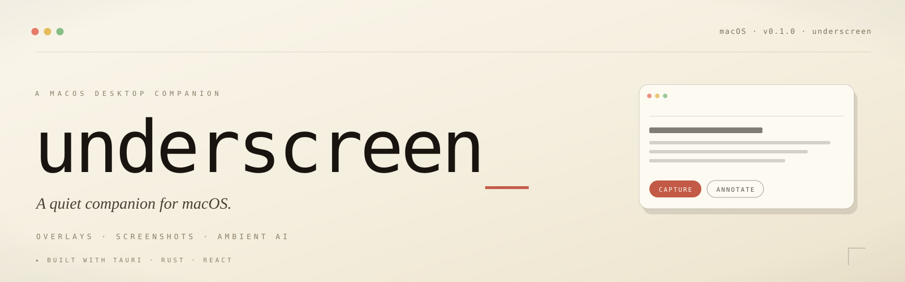

<div align="center">

<picture>
  <source media="(prefers-color-scheme: dark)" srcset="./apps/desktop/public/banner-dark.svg">
  <source media="(prefers-color-scheme: light)" srcset="./apps/desktop/public/banner-light.svg">
  
</picture>

<br/>
<br/>

<a href="#-the-idea"></a>
<a href="#-architecture"></a>
<a href="#-architecture"></a>
<a href="#-architecture"></a>
<a href="#-architecture"></a>
<a href="#-license"></a>
<a href="#-roadmap"></a>

<br/>
<br/>

<sub>
<a href="#-the-idea">The idea</a>
&nbsp;·&nbsp;
<a href="#-features">Features</a>
&nbsp;·&nbsp;
<a href="#-design-principles">Principles</a>
&nbsp;·&nbsp;
<a href="#-architecture">Architecture</a>
&nbsp;·&nbsp;
<a href="#-get-started">Get started</a>
&nbsp;·&nbsp;
<a href="#-project-layout">Project layout</a>
&nbsp;·&nbsp;
<a href="#-roadmap">Roadmap</a>
</sub>

</div>

<br/>

> *Underscreen is a small, considered macOS utility — overlays that appear only when needed, screenshot flows that feel native, and lightweight AI tooling that stays out of the way. It is meant to disappear when you don't need it, and be exactly there when you do.*

<br/>

---

## ✦ The idea

There are dozens of utilities that try to live on top of your screen. Most of them shout.

**Underscreen** tries the opposite — to live *underneath*: a calm layer of small, well-made tools that surface when you ask and vanish when you don't. A floating overlay for a thought you're holding. A faster way to crop, annotate, and share what's in front of you. A few quiet AI helpers that earn their keep without demanding attention.

The whole thing is built native where it matters (Rust, via Tauri) and modern where it should be (TypeScript and React), and the seams between them are short and direct.

<br/>

---

## ✦ Features

<table>
<tr>
<td width="50%" valign="top">

#### `›`&nbsp;&nbsp;Overlay widgets

Lightweight panels that fade in on demand, hold a single piece of context, and disappear when you're done. Keyboard-first, always-on-top when needed, gone otherwise.

</td>
<td width="50%" valign="top">

#### `›`&nbsp;&nbsp;Native screenshots

Rapid capture, crop, annotate, export. The shutter is fast, the crop is exact, the markup is calm. Optimized for the moments between thinking and sharing.

</td>
</tr>
<tr>
<td width="50%" valign="top">

#### `›`&nbsp;&nbsp;Ambient AI

A small set of contextual helpers — summarize, rephrase, explain — wired into the things you already do. No chat window. No mode switch. Just suggestions, in the right place.

</td>
<td width="50%" valign="top">

#### `›`&nbsp;&nbsp;Rust core

Performance-critical work runs in a Rust backend through Tauri. The UI thread stays responsive; system integrations stay safe and fast.

</td>
</tr>
<tr>
<td width="50%" valign="top">

#### `›`&nbsp;&nbsp;Modular engines

Discrete services for ASR, audio, overlay management, and context. Each one is replaceable; features compose without entanglement.

</td>
<td width="50%" valign="top">

#### `›`&nbsp;&nbsp;Native feel

Adapts to system appearance. Respects keyboard conventions. Honors accessibility. Looks like it belongs on macOS because it does.

</td>
</tr>
</table>

<br/>

---

## ✦ Design principles

<table>
<tr>
<th align="left" width="25%"><sub>01 / CLARITY</sub></th>
<th align="left" width="25%"><sub>02 / DELIGHT</sub></th>
<th align="left" width="25%"><sub>03 / PERFORMANCE</sub></th>
<th align="left" width="25%"><sub>04 / EXTENSIBILITY</sub></th>
</tr>
<tr>
<td valign="top">

Interfaces that disappear when not needed; only the essential controls surface.

</td>
<td valign="top">

Subtle motion, considerate defaults, refined typography, and small unexpected details.

</td>
<td valign="top">

Lightweight native components with efficient Rust/macOS backends behind every interaction.

</td>
<td valign="top">

A modular architecture so new features land without friction or rework.

</td>
</tr>
</table>

<br/>

---

## ✦ Architecture

A short pipeline between the things a person presses and the things the system actually does.

```
   ┌─────────────────────────────────────────────────────────────────────┐
   │                         underscreen · macOS                         │
   ├─────────────────────────────────────────────────────────────────────┤
   │                                                                     │
   │   apps/desktop/src         ──  Frontend     · TypeScript · React    │
   │   apps/desktop/src-tauri   ──  Native core  · Rust · Tauri          │
   │   services/                ──  Engines      · ASR · audio · ctx     │
   │   infra/                   ──  Tooling      · build · packaging     │
   │                                                                     │
   └─────────────────────────────────────────────────────────────────────┘

      UI  ◀── IPC ──▶  Native (Rust)  ◀── trait calls ──▶  Engines
```

**Frontend** &nbsp;·&nbsp; TypeScript + React, served by Vite. Owns presentation and interaction; talks to the native layer over Tauri's IPC bridge.

**Native layer** &nbsp;·&nbsp; Rust, embedded via Tauri. Owns macOS integrations (window management, capture, hotkeys) and orchestrates engines.

**Engines** &nbsp;·&nbsp; Modular services under `services/` — each one is a small, focused crate or module that can be developed and tested in isolation.

This separation keeps the UI snappy while letting native access stay safe and explicit.

<br/>

---

## ✦ Get started

> Requires macOS 11+, Node.js (LTS), and the Rust toolchain.

<br/>

<details open>
<summary><b>1.&nbsp;&nbsp;Frontend only</b> &nbsp;<sub>(fastest path — UI work in the browser)</sub></summary>

<br/>

```bash
cd apps/desktop
pnpm install
pnpm dev
```

The Vite dev server starts and serves the React app. Useful for iterating on UI without booting the native shell.

</details>

<details>
<summary><b>2.&nbsp;&nbsp;Full Tauri shell</b> &nbsp;<sub>(everything — UI + native integrations)</sub></summary>

<br/>

```bash
cd apps/desktop
pnpm install
pnpm tauri dev
```

Boots the Rust backend alongside the frontend. You'll need the Rust toolchain installed; see [tauri.app](https://tauri.app/v1/guides/getting-started/prerequisites) for platform prerequisites.

</details>

<details>
<summary><b>3.&nbsp;&nbsp;Production build</b> &nbsp;<sub>(packaged macOS app)</sub></summary>

<br/>

```bash
cd apps/desktop
pnpm install
pnpm build
pnpm tauri build
```

Produces a signed (or unsigned) `.app` bundle under `apps/desktop/src-tauri/target/release/bundle/`. See [`apps/desktop/README.md`](apps/desktop/README.md) for project-specific build notes and code-signing setup.

</details>

<br/>

---

## ✦ Project layout

```
underscreen/
├── apps/
│   └── desktop/
│       ├── src/                ·  React + TypeScript frontend
│       └── src-tauri/          ·  Rust native layer
│           └── src/
├── services/                   ·  Modular engines
│   ├── asr/                    ·  Speech recognition  (deferred)
│   ├── audio/                  ·  Audio capture & I/O
│   ├── context/                ·  Context tracking
│   └── overlay/                ·  Overlay management
├── infra/                      ·  Build, packaging, dev helpers
├── docs/                       ·  Design notes & decisions
└── underscreen_report.md
```

| Path | What lives here |
| :--- | :--- |
| `apps/desktop/src` | All UI code — components, hooks, styles, routes |
| `apps/desktop/src-tauri/src` | Rust entrypoints, IPC commands, native handlers |
| `services/*` | One engine per folder; each owns its public surface |
| `infra/` | Scripts that build, package, and ship the app |
| `docs/` | Design rationale and ADR-style notes |

<br/>

---

## ✦ Roadmap

A short, honest plan. Polish first, capability second, ambition third.

```
   NOW       ───●   Overlays, screenshot UX, stability
                 │
                 ▼
   NEXT      ───○   Context-aware annotations · light AI helpers
                 │
                 ▼
   LATER     ───○   Optional speech-to-text (audio engine deferred)
                 │
                 ▼
   ONE DAY   ───○   Plugin surface · third-party engines
```

<sub>Filled circles ship; open circles are intent, not commitment.</sub>

<br/>

---

## ✦ Contributing

Small, focused pull requests are the best kind. A few notes:

- **Keep changes modular** &nbsp;·&nbsp; one feature, one PR, where it's reasonable.
- **Add tests for new behavior** &nbsp;·&nbsp; especially around IPC and engine boundaries.
- **Document UX decisions** &nbsp;·&nbsp; in `docs/` or in `underscreen_focused_rd_report.md`.
- **Propose features in an issue first** &nbsp;·&nbsp; a short design rationale and intended user benefit goes a long way.

If you're not sure where something fits, open an issue and we'll figure it out together.

<br/>

---

## ✦ Files & where to look

| | |
| :--- | :--- |
| **UI** | `apps/desktop/src` |
| **Native** | `apps/desktop/src-tauri` |

<br/>

---

## ✦ License

Open source. See [`LICENSE`](LICENSE) - Do whatever you want.

<br/>
<br/>


<p align="center">
  <i>Built with ☕ and questionable sleep schedules.</i>
</p>

<div align="center">
<p>
  <i>
    Connect with me –
  </i>
</p>

  <a href="https://www.linkedin.com/in/meghan31/" target="_blank">
  </a>
  <a href="https://www.instagram.com/me_gun_31/" target="_blank">
  </a>
  <a href="https://www.meghan31.me/" target="_blank">
    </a>
  <a href="mailto:meghasrivardhanp@gmail.com" target="_blank">
  </a>
 

  
</div>
